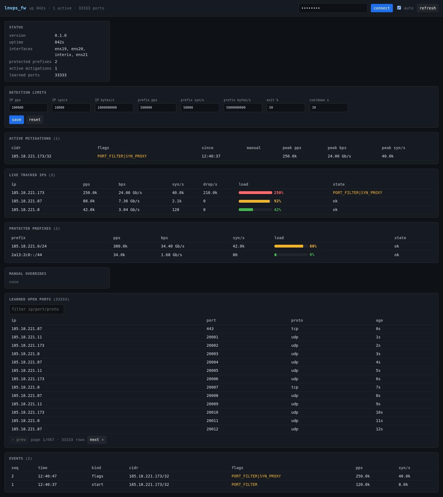

# lnvps_fw — XDP/eBPF DDoS Protection

`lnvps_fw` is a self-contained DDoS mitigation system that can run on **any**
Linux box in the traffic path — routers, VM hosts, edge/scrubbing boxes,
wherever protection is needed. It attaches XDP + TC eBPF programs to the uplink
NIC(s), passively learns which ports each protected IP actually serves, and —
only when a destination comes under attack — sheds illegitimate traffic in the
kernel at line rate while leaving legitimate traffic untouched.

The protected IPs behind it can be **anything** the box routes or hosts — guest
VMs, dedicated / bare-metal servers, colocated boxes, services on the host
itself, or any downstream host reachable through a router. The system is
agnostic to what lives behind the protected address; it only cares about the
traffic to it.

It is designed around a real threat model: **spoofed carpet-bomb / reflection
floods from millions of source IPs across a whole prefix**, not just targeted
single-IP attacks.



> This is a standalone Cargo sub-workspace, **excluded** from the root
> `lnvps_api` workspace, because the eBPF crate must build for the
> `bpfel-unknown-none` target with its own toolchain.

---

## Design principles

1. **eBPF counts and enforces; userspace decides.** The datapath never computes
   policy. It maintains counters and applies simple lookup-table verdicts
   written by the userspace daemon. All rate math, thresholds, detection, and
   escalation live in userspace where they are unit-testable.
2. **Steady state is pass-all.** With no attack in progress, every packet passes
   (the datapath only counts and learns). Enforcement is switched on per
   destination/prefix by userspace.
3. **Efficacy-ordered protection.** Layers are prioritised by how much
   illegitimate traffic they drop with the fewest false positives. The cheap,
   high-efficacy open-port drop does the heavy lifting first; source/CIDR
   blocking (highest false-positive risk, useless against spoofed floods) is a
   last resort, and is gated so it never fires against spoofed traffic.
4. **Everything is bounded.** Per-source counters are LRU-bounded; the CIDR block
   structure is an LPM trie kept small by aggregation. The datapath never tries
   to track "every /32".

---

## Architecture

```
                          uplink NIC (e.g. eno2)
                                   │
        ┌── XDP ingress  (xdp_lnvps) ──────────────────────────────────┐
        │  parse eth/v4/v6 + tcp/udp/icmp                               │
        │  count per-destination (LruPerCpuHashMap)                     │
        │  if dest has protection flags (from userspace):              │
        │    • SOURCE_BLOCK → drop sources in the CIDR LPM trie         │
        │    • SYN_PROXY    → tail-call xdp_syn_proxy for TCP-to-open   │
        │    • PORT_FILTER  → drop fragments + traffic to non-open ports│
        │    • count the source (LruPerCpuHashMap) for userspace        │
        └──────────────────────────────────────────────────────────────┘
        ┌── xdp_syn_proxy (tail-call program) ─────────────────────────┐
        │  SYN → craft SYN-ACK w/ SYN-cookie (XDP_TX), drop SYN         │
        │  ACK → validate cookie → mark source verified                │
        └──────────────────────────────────────────────────────────────┘
        ┌── TC egress    (tc_lnvps_egress, clsact) ────────────────────┐
        │  learn open ports: SYN-ACK from ip:port → TCP open           │
        │                    outbound UDP from ip:port → UDP service    │
        └──────────────────────────────────────────────────────────────┘
                                   │ BPF maps
        ┌── lnvps_fw_service (userspace daemon) ───────────────────────┐
        │  • samples per-dest + per-prefix counters, runs detection    │
        │    state machine, writes protection flags into DEST_STATE    │
        │  • samples per-source counters, aggregates offenders into    │
        │    CIDR blocks (spoof-gated), decays them                    │
        │  • learned-port TTL GC, cookie-secret rotation, verified GC  │
        │  • loads config (interfaces, thresholds, protected prefixes) │
        └──────────────────────────────────────────────────────────────┘
```

- XDP is ingress-only, so open-port **learning** uses a TC egress (clsact)
  program on the same uplink; both share pinned BPF maps loaded from one object.
- On a **forwarding router**, roles split across NICs (see below): the XDP
  filter attaches to the internet-facing NIC(s) and is **GRE-decap-aware** (it
  filters on the inner header of BGP-over-GRE traffic), while learning runs on
  the VM-facing NIC's ingress.
- `xdp_syn_proxy` is a separate XDP program reached via `bpf_tail_call` (a
  `PROG_ARRAY`), so its packet-rewrite complexity is verified independently of
  the main program.

### Crates

| Crate | Target | Role |
|---|---|---|
| `lnvps_ebpf` | `bpfel-unknown-none` | The XDP + TC eBPF programs and maps. Not a default workspace member. |
| `lnvps_fw_common` | host + eBPF (`#![no_std]`) | Types shared across the map boundary (counters, keys, `DestState`), the SYN-cookie function, and constants. `aya::Pod` impls behind the `user` feature. |
| `lnvps_fw_service` | host | The userspace daemon: config, detection state machine, CIDR aggregation, GC, and the control loop that programs the maps. Also exposes a library used by the test harness. |

---

## The protection model (flags)

A destination's mitigation state (`DestState.mode`) is a **bitmask of
independent protection flags**, stored in an LPM trie keyed by IP — so userspace
can apply a flag to a single `/32` or a whole protected prefix (e.g. `/22`) with
one entry. The XDP datapath applies each set flag independently:

| Flag | Effect | Efficacy / FP |
|---|---|---|
| `PORT_FILTER` (`1<<0`) | drop non-first fragments + traffic to non-learned-open ports (ICMP passes) | **Highest efficacy, lowest FP** — the phase-1 heavy lifter; kills reflection/amplification and random-port floods regardless of source count |
| `SYN_PROXY` (`1<<1`) | validate TCP handshakes to open ports with SYN cookies | High efficacy, low FP — the answer for spoofed SYN floods to *open* TCP ports |
| `RATE_CAPS` (`1<<2`) | per-`(dst,port)` rate caps for open UDP/ICMP (reserved) | not yet implemented |
| `SOURCE_BLOCK` (`1<<3`) | drop sources matching a blocked CIDR | Low efficacy vs spoofed, high FP — **last resort**, only enabled for bounded/real botnets |

Userspace enables flags **in efficacy order** and only escalates when the
cheaper layers have not already shed the attack:

- On detection, a dest/prefix gets `PORT_FILTER`.
- A sustained SYN flood adds `SYN_PROXY` (`syn-proxy-syn-pps`).
- `SOURCE_BLOCK` is added **only** if traffic keeps getting through after the
  port filter (`escalate-pass-pps`) **and** the offender set is bounded (the
  *spoof gate*, `max-real-sources`). Under a spoofed flood the offender set
  explodes, so source blocking is skipped entirely — the port filter carries it.

### How each threat is handled

- **Reflection / amplification** (UDP replies from src port 53/123/11211/…): land
  on ports the protected host never opened → dropped by `PORT_FILTER`. Source-count
  independent.
- **Carpet bombing** (thin spread across many IPs): no single IP trips its
  threshold, but the aggregate over a protected prefix does → the whole prefix
  flips to `PORT_FILTER` in one LPM entry.
- **Spoofed SYN flood to an open TCP port**: `SYN_PROXY` answers with a
  SYN-cookie SYN-ACK; spoofed sources can't complete the handshake, so they
  never reach the protected host; real clients complete it and are allow-listed.
- **Real botnet hammering open services**: bounded real sources are aggregated
  into CIDR blocks (`SOURCE_BLOCK`).

---

## SYN-proxy / SYN-cookies

Under `SYN_PROXY`, a TCP SYN to a learned-open port from an unverified source is
tail-called into `xdp_syn_proxy` (IPv4) or `xdp_syn_proxy_v6` (IPv6), which:

1. computes a cookie = fast keyed hash (`syn_cookie_v4`/`_v6`) of the 4-tuple + a
   rotating secret (`COOKIE_SECRET`, current + previous slots),
2. rewrites the SYN in place into a SYN-ACK carrying the cookie as its sequence
   number, recomputes IP/TCP checksums, and `XDP_TX`es it back — dropping the
   original SYN,
3. on the client's ACK, validates `ack_seq - 1 == cookie`; a match marks the
   source **verified** (`VERIFIED_V4`/`VERIFIED_V6`). Verified sources pass through,
   so the client's connection retry reaches the protected host.

The cookie need not be cryptographic: a spoofed source never receives the
SYN-ACK, so it can never learn the cookie. The secret is rotated by the daemon;
the previous slot keeps in-flight cookies valid across a rotation.

---

## BPF maps

| Map | Type | Written by | Read by |
|---|---|---|---|
| `V4/V6_DEST_COUNTERS` | LRU per-CPU hash | XDP | daemon (detection) |
| `V4/V6_SRC_COUNTERS` | LRU per-CPU hash | XDP (under mitigation) | daemon (source control) |
| `V4/V6_DEST_STATE` | LPM trie → `DestState` | daemon | XDP (mode lookup) |
| `OPEN_PORTS_V4/V6` | LRU hash → `LastSeen` | TC egress (learning) | XDP; daemon (TTL GC) |
| `V4/V6_CIDR_SRC` | LPM trie | daemon (escalation) | XDP (`SOURCE_BLOCK`) |
| `VERIFIED_V4/V6` | LRU hash | XDP (`xdp_syn_proxy`/`_v6`) | XDP; daemon (TTL GC) |
| `COOKIE_SECRET` | array[2] | daemon (rotation) | XDP |
| `SYN_PROXY_JUMP` | prog array | daemon (setup) | XDP (`tail_call`) |

---

## Install (Debian/Ubuntu, from GitHub Releases)

Each tagged release ships a prebuilt `.deb` (built by
[`.github/workflows/lnvps_fw-deb.yml`](../.github/workflows/lnvps_fw-deb.yml)
via `cargo-deb`) attached to the corresponding
[GitHub release](https://github.com/LNVPS/api/releases). The package includes
the daemon binary, the `lnvps_fw.service` systemd unit, and the example config —
you do **not** need a Rust or eBPF toolchain to install it (the eBPF object is
compiled into the binary at release-build time).

1. **Download the latest `.deb`.** Grab it from the
   [releases page](https://github.com/LNVPS/api/releases/latest), or from the
   shell:

   ```sh
   # picks the newest release and its lnvps-fw .deb asset (amd64)
   URL=$(curl -fsSL https://api.github.com/repos/LNVPS/api/releases/latest \
     | grep -o 'https://[^"]*lnvps-fw_[^"]*_amd64\.deb')
   curl -fLO "$URL"
   ```

2. **Install it.** `apt` pulls in the auto-detected shared-library deps:

   ```sh
   sudo apt install ./lnvps-fw_*_amd64.deb
   ```

   This installs:

   | Path | What |
   |---|---|
   | `/usr/bin/lnvps_fw_service` | the daemon binary |
   | `/lib/systemd/system/lnvps_fw.service` | systemd unit (runs as root; needs `CAP_NET_ADMIN`+`CAP_BPF`) |
   | `/etc/lnvps_fw/config.example.yaml` | fully-commented example config |

   The post-install script reminds you that no `config.yaml` exists yet and
   does **not** auto-start the service.

3. **Configure.** Copy the example and set at least your uplink NIC(s):

   ```sh
   sudo cp /etc/lnvps_fw/config.example.yaml /etc/lnvps_fw/config.yaml
   sudo editor /etc/lnvps_fw/config.yaml   # set `interfaces:` (and `protected:` on a router)
   ```

   The unit runs `lnvps_fw_service --config /etc/lnvps_fw/config.yaml`. See the
   [Running](#running) and [Deployment: host vs router](#deployment-host-vs-router)
   sections below for what to put in it.

4. **Enable and start:**

   ```sh
   sudo systemctl enable --now lnvps_fw
   sudo systemctl status lnvps_fw
   sudo journalctl -u lnvps_fw -f
   ```

### Kernel requirements

A reasonably recent kernel with XDP + BPF LRU maps (Debian 12/Ubuntu 22.04 or
newer is comfortable). The unit sets `LimitMEMLOCK=infinity` for the BPF maps
and runs as root because loading XDP/eBPF programs needs full privileges.

### Staying up to date (self-upgrade)

Once it has an API configured, the daemon checks the GitHub
[`releases/latest`](https://api.github.com/repos/LNVPS/api/releases/latest) API
on startup and every ~6h, and can install a newer signed `.deb` for you via the
`GET`/`POST /api/v1/upgrade` control endpoints — so you generally only install
the `.deb` by hand once. Because that check compares the running binary's
compiled version against the newest `vX.Y.Z` tag, always install the `.deb` from
a **tagged release** (not an ad-hoc `workflow_dispatch` build) to avoid a
perpetual "upgrade available" state.

---

## Building

> Building from source is only needed for development or to run on an
> architecture without a prebuilt `.deb`. To just deploy the daemon, use the
> [release `.deb`](#install-debianubuntu-from-github-releases) above.

The host crates build normally; the eBPF object is compiled automatically by
`lnvps_fw_service/build.rs` (via `aya-build`) for the `bpfel-unknown-none`
target.

```sh
cd lnvps_fw
cargo build            # builds lnvps_fw_common + lnvps_fw_service (+ ebpf object)
cargo test             # host unit tests (harness tests are #[ignore]d)
```

Prerequisites for compiling the eBPF object:

- a Rust **nightly** toolchain with `rust-src`,
- **bpf-linker** (`cargo install bpf-linker`).

---

## Running

```sh
# with a config file
lnvps_fw_service --config config.yaml

# or just interface names (all other settings default)
lnvps_fw_service eno2 eno3
```

Requires `CAP_NET_ADMIN` + `CAP_BPF` (run as root). See
[`lnvps_fw_service/config.example.yaml`](lnvps_fw_service/config.example.yaml)
for the full, commented configuration. Configuration is YAML with kebab-case
keys, matching the rest of the LNVPS API config style. Key sections:

- `interfaces` — uplink NIC(s) to attach to.
- `protected` — CIDR prefixes this host serves (enables carpet-bomb mitigation).
- `thresholds` — per-destination entry thresholds + hysteresis/cooldown.
- `network` — aggregate per-prefix thresholds (network scale).
- `learning` — port-learning TTL and GC cadence.
- `escalation` — per-source rate, CIDR aggregation fan-out, spoof gate, and the
  SYN-proxy trigger.

> The `protected` prefixes and thresholds will be sourced from the LNVPS API in
> a later increment; the local config is the bootstrap today.

---

## Testing

Datapath behaviour is verified with a **virtualized-network integration
harness** built from Linux network namespaces + veth pairs. It loads the real
eBPF object into a `filter` namespace (XDP in SKB/generic mode), drives real
traffic through it, and asserts against the BPF maps. These tests require root
and are `#[ignore]`d so a plain `cargo test` stays green.

```sh
# builds the ebpf object, then runs the harness tests as root
../scripts/fw-e2e.sh                 # all
../scripts/fw-e2e.sh --test syn_proxy  # one binary
```

Test binaries (`lnvps_fw_service/tests/`):

| Binary | Covers |
|---|---|
| `smoke` | program attach, per-dest counters, forwarding, SYN counting |
| `learning` | TC egress learns open TCP/UDP ports; TTL GC |
| `mitigation` | port-filter drops, learned-port pass, detect→cooldown, flag gating |
| `escalation` | per-source rate → aggregated CIDR block + decay |
| `carpet_bomb` | thin prefix-wide flood flips the whole prefix |
| `syn_proxy` | real client completes the cookie handshake + is verified; spoofed never verify |

See [`docs/agents/fw-testing.md`](../docs/agents/fw-testing.md) (repo root) for
harness internals, kernel prerequisites, and how to add scenarios.

The pure userspace logic (detection state machine, CIDR aggregation, config,
GC, SYN-cookie) is covered by ordinary `cargo test` unit tests.

---

## Deployment: host vs router

Each interface has a **role** (config `interfaces:`):

- **host** (default; a bare interface name) — one NIC that carries the protected
  IPs directly. XDP filter (ingress) + TC-egress port learning on that NIC.
- **filter** — a forwarding router's internet-facing NIC(s). XDP ingress filter,
  **GRE-decap-aware**: attack traffic to protected IPs is dropped even when it
  arrives inside a BGP-over-GRE tunnel. Attach to the **underlay** NIC to shed
  the flood *before* the kernel spends CPU decapsulating + routing it (protects
  the router itself, not just the VMs).
- **learn** — the router's VM-facing NIC. TC-ingress port learning (VM replies
  enter here as plain L2). No filtering.

```yaml
# host (single NIC)
interfaces: [eno2]

# router (BGP-over-GRE underlays + VM NIC)
interfaces:
  - { name: ens19, role: filter }   # underlay: GRE-decap + filter
  - { name: ens20, role: filter }
  - { name: interix, role: filter } # direct L2 peering
  - { name: ens21, role: learn }    # VM network: learn open ports
```

GRE decap parses the outer IP + GRE header (variable length via the C/K/S flag
bits) and runs the normal per-dest/per-prefix logic on the inner IP. SYN-proxy
is disabled on the decapsulated path (it can't re-encapsulate a reply); the
port-filter, source-block, and rate/prefix mitigations all still apply.

### Scope (`protected`)

`protected` is the **scope** of the whole firewall, enforced in XDP:

- **Set** — only traffic to a protected destination is counted/mitigated;
  everything else is `XDP_PASS`ed untouched and never enters the counter maps.
  Port-learning is likewise limited to protected IPs. **Required on a router**
  so it never mitigates (or drops) third-party transit traffic it merely
  forwards.
- **Empty** — protect *every* destination (single-NIC host mode). Fine for a
  host; dangerous on a router.

Prefixes come from config or the control API and are synced into `PROTECTED_V4/
V6` LPM tries plus a `scoped` flag the datapath checks per packet.

## Control API & dashboard

The daemon exposes an optional **HTTPS** RESTful control API (token-authed) and
an internal HTML dashboard ([screenshot](docs/dashboard.png)). It is the
*server*; the primary `lnvps_api` service is the *client* and source of truth.
There is **no database** on the host: rules are pushed by `lnvps_api` and held
in memory, and mitigation events go into a bounded in-memory ring buffer that
`lnvps_api` polls (monotonic cursor) and persists. HTTPS is mandatory — a
self-signed cert is auto-generated if none is configured. Endpoints cover status,
rules (GET/PUT), manual overrides (POST/DELETE), active mitigations, learned
ports (`/ports`, server-paginated + filtered), live per-IP rates (`/tracked`),
and events.

The dashboard at `/` is a self-contained **HTM + Preact** app: live per-IP
rates, learned open ports, active mitigations, rules, and an event feed — every
table paginated so it stays responsive even with tens of thousands of learned
ports.

Preview it without root:

```sh
cargo run -p lnvps_fw_service --example serve_api
# then open https://127.0.0.1:8899/ (token: devtoken)
```

See [`docs/agents/fw-api.md`](../docs/agents/fw-api.md) for the full endpoint
reference, auth, and the `lnvps_api` integration contract.

---

## Status & roadmap

Implemented and root-validated: passive port learning, per-destination and
per-prefix detection, the flag-based protection model (`PORT_FILTER`,
`SOURCE_BLOCK`, `SYN_PROXY`), spoof-gated CIDR escalation, and the SYN-proxy
datapath.

The SYN-proxy covers both IPv4 and IPv6 (`xdp_syn_proxy` / `xdp_syn_proxy_v6`,
tail-called at slots 0/1).

The control API (increment 7) is implemented on the fw_service side: HTTPS +
token auth, in-memory rules pushed by `lnvps_api`, an event ring buffer, manual
overrides, and the dashboard.

Packaging: a GitHub Actions workflow (`.github/workflows/lnvps_fw-deb.yml`)
builds a `.deb` (via `cargo-deb`) that installs the daemon binary, a systemd
unit (`lnvps_fw.service`), and the example config; it is attached to GitHub
releases on version tags.

Not yet done: `RATE_CAPS` (per-`(dst,port)` caps for open UDP); the `lnvps_api`
side of the contract (rules-push client, event-poll-and-persist loop, DB +
admin UI); and a Prometheus metrics endpoint.

See [`work/ddos-protection.md`](../work/ddos-protection.md) (repo root) for the
detailed increment log, design decisions, and verifier notes.
